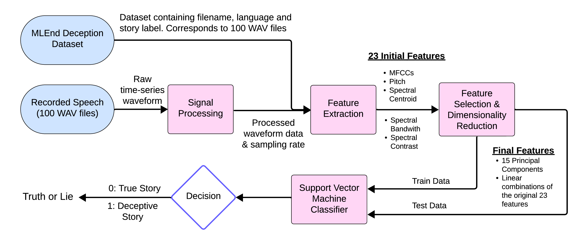

# MS MARCO Passage Ranking with SBERT

This project implements a re-ranking pipeline for the MS MARCO Passage Ranking dataset using Sentence-BERT (SBERT). The goal is to train a model that scores passages based on their semantic relevance to a given query, enabling more accurate search and retrieval.

The pipeline uses supervised learning with relevance labels (`qrels`) to fine-tune SBERT on query-passage pairs. After training, the model is evaluated using metrics such as MRR and nDCG on a held-out development set to assess generalization.

Key features:
- Preprocessing of collection, queries, and qrels files
- Pointwise training of SBERT for binary relevance classification
- Evaluation on dev queries using standard IR metrics
- Designed for modular extension with hard negatives or alternate ranking losses

This repository is ideal for researchers and practitioners interested in semantic search, neural ranking models, and reproducible information retrieval experiments.
